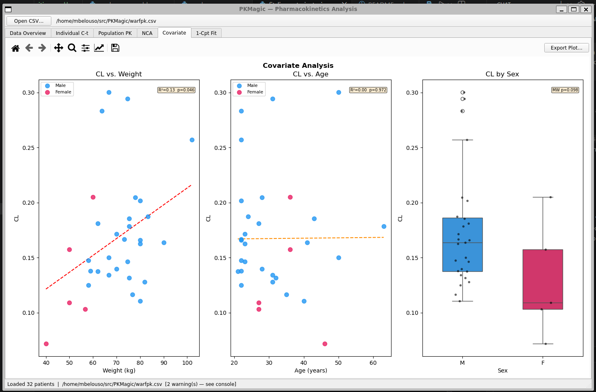

# PKMagic

PKMagic is an interactive desktop application for population pharmacokinetics (PK) analysis.
It is primarily a **teaching tool** — the code is written with beginners in mind and is
heavily commented to explain both the Python language concepts and the underlying PK science.

It was built as a worked example for the MIPS 2026 bootcamp to show how a small, real-world
scientific application is structured using PyQt5, pandas, NumPy, SciPy, and Matplotlib.

## Code Structure

The application is split into four short, focused files — each one is a good place to start reading:

| File | What it does |
|------|--------------|
| `main.py` | Creates the Qt application and main window; good first read (~115 lines) |
| `pk_data.py` | Loads the CSV, cleans data, runs NCA, and fits the compartment model |
| `pk_tabs.py` | Qt tab widgets that embed the matplotlib plots |
| `pk_plots.py` | Pure matplotlib drawing functions (no Qt — can be used in a notebook) |

Every file contains inline comments explaining *why* each piece of code is written the way it is,
including Python-specific concepts (list comprehensions, dataclasses, signals/slots, etc.) and
pharmacokinetic concepts (NCA, lambda-z, AUC, one-compartment model).

## Features

| Tab | Description |
|-----|-------------|
| **Data Overview** | Demographics histograms (age, weight, sex), dose vs weight scatter, per-patient summary table |
| **Individual C-t** | Concentration–time profile for every subject; color by sex or body weight |
| **Population PK** | Mean ± 95 % CI overlay, sex-stratified and weight-quartile-stratified mean curves |
| **NCA** | Non-compartmental analysis: Cmax, Tmax, AUC₀ₜ, AUC₀∞, t½, CL, Vd per patient |
| **Covariate** | CL vs weight and age scatter with regression trend; CL by sex box-plot with Mann–Whitney U test |
| **1-Cpt Fit** | One-compartment IV-bolus model `C(t) = (D/V)·exp(−(CL/V)·t)` fitted per patient; population mean overlay |

All plot panels include a matplotlib navigation toolbar for zoom, pan, and save.



## Installation

Requires [Anaconda](https://www.anaconda.com/) or [Miniconda](https://docs.conda.io/en/latest/miniconda.html).

```bash
# 1. Clone or download this repository
git clone <repo-url>
cd PKMagic

# 2. Create the conda environment
conda env create -f environment.yml

# 3. Activate it
conda activate pkmagic
```

## Running

```bash
conda activate pkmagic
python main.py
```

Click **Open CSV…** in the toolbar and select your PK data file.

## Input CSV Format

The application expects a NONMEM-style CSV with these columns (column names are flexible — extras are ignored):

| Column | Description |
|--------|-------------|
| `#ID` | Subject identifier |
| `time(min)` | Time post-dose |
| `wt(kg)` | Body weight (kg) |
| `age` | Age (years) |
| `sex` | Sex (1 = male, 0 = female) |
| `amt` | Dose amount (`.` for observation rows) |
| `rate` | Infusion rate (`-2` = IV bolus) |
| `dependtvariable` | Dependent variable type flag |
| `dv(mg/L)` | Observed concentration (`.` for dose/BLQ rows) |
| `mdv` | Missing DV flag (1 = dose event or BLQ, 0 = valid observation) |

Missing values should be encoded as `.` (NONMEM convention).

## Example Data

`warfpk.csv` — 33 subjects receiving IV warfarin; used as the reference dataset for the bootcamp.

## Dependencies

| Package | Purpose |
|---------|---------|
| PyQt5 | Desktop GUI framework |
| pandas | Data loading and manipulation |
| numpy | Numerical computations |
| scipy | Curve fitting, statistics, ODE solving |
| matplotlib | Embedded plots |
| seaborn | Statistical visualisations |
